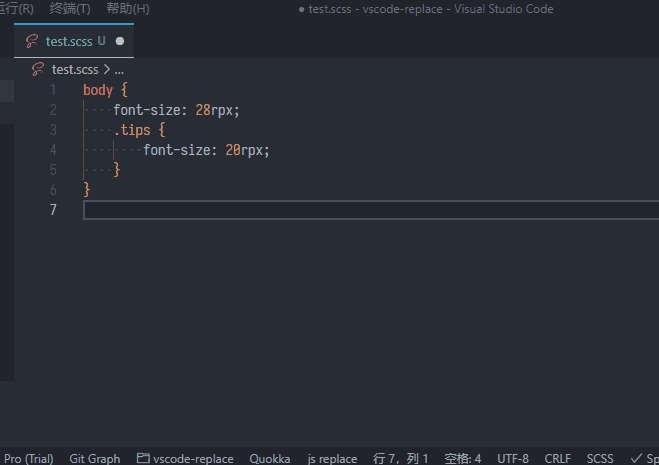
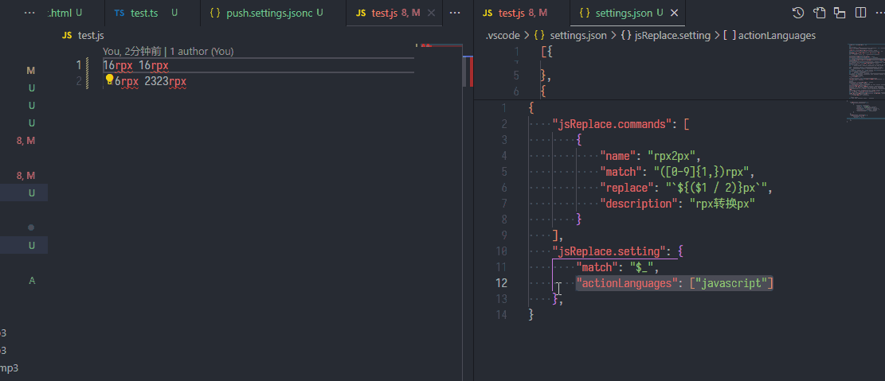

# vscode-replace

[English doc](./README.md)

## Features

对选中文本执行 js 计算

## 示例

#### 1. 使用命令



#### 2. 使用 code action



| 参数         | 类型     | 说明                                                                                                                          |
| ------------ | -------- | ----------------------------------------------------------------------------------------------------------------------------- |
| `$1 到 $n`   | `String` | 匹配到的分组内容，从 `$1` 到 `$n` (配置中可修改变量前缀)                                                                      |
| `$_`         | `String` | 匹配到的子串，即正则表达式匹配到的内容（配置中可修改该变量名）                                                                |
| `ChangeCase` | `Object` | 内置的 [change case](https://www.npmjs.com/package/change-case) 变量，包含 change-case 的工具函数，例如 ChangeCase.pascalCase |

## 参数说明

```json
{
    // 注册replace命令
    "jsReplace.commands": [
        {
            // 指令名称
            "name": "rpx2px",
            // 用于匹配文字的正则表达式
            "match": "([0-9]{1,})rpx",
            // 匹配后的处理，使用js表达式，
            // $1表示匹配到的第一个分组内容，$_表示匹配的子串
            "replace": "`${($1 / 2)}px`",
            // 描述
            "description": "rpx转换px"
        },
        {
            "name": "define pascalCase",
            "match": "\\w{1,}",
            "replace": "ChangeCase.pascalCase($_)",
            "description": "AaBb"
        }
    ],
    "jsReplace.setting": {
        // 匹配的子串变量
        "match": "$_",
        // 匹配到分组变量的前缀，设置为$，则变量为$1到$n
        "prefix": "$",
        // 将命令注册到code action中
        "actionLanguages": [
            "javascript",
            "typescript",
            "html",
            "css",
            "less",
            "typescriptreact",
            "scss",
            "python",
            "markdown",
            "json",
            "javascriptreact",
            "sass",
            "go",
            "c"
        ],
        // code action需要忽略的命令，填写jsReplace.commands中定义的"name"字段
        "actionIgnoreCommands": [
            // 例如："define pascalCase"
        ]
    }
}
```
