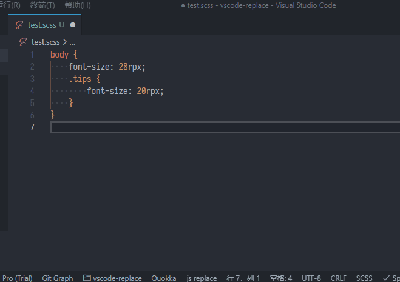

# JS Replace <!-- omit in toc -->

[中文文档](./README-zh-cn.md)

match text and transform with JavaScript expression



**Table of Contents**

- [Features](#features)
    - [Use command](#use-command)
    - [Use code action](#use-code-action)
- [Configuration](#configuration)
    - [Parameter description of replace](#parameter-description-of-replace)
    - [Configuration example](#configuration-example)
    - [Change case config example](#change-case-config-example)

## Features

- Matches the currently open editor content, transform with JavaScript expression
- Manually select the text, transform with JavaScript expression

#### Use command

<details>
<summary>example</summary>


</details>

#### Use code action

<details>
<summary>example</summary>


</details>

## Configuration

#### Parameter description of replace

<details>
<summary>table</summary>

| parameter    | type     | description                                                                                                                                          |
| ------------ | -------- | ---------------------------------------------------------------------------------------------------------------------------------------------------- |
| `$1` to `$n` | `String` | Matched groupings from `$1` to `$n` (The variable prefix can be modified in the configuration)                                                       |
| `$_`         | `String` | The substring that the regular expression matches (The variable name can be modified in the configuration)                                           |
| `$order`     | `Number` | The numerical order, start with 0 (The variable name can be modified in the configuration)                                                           |
| `ChangeCase` | `Object` | The built-in [change case](https://www.npmjs.com/package/change-case) variable contains change-case utility functions, such as ChangeCase.pascalCase |

</details>

#### Configuration example

<details>
<summary>example</summary>

```json
{
    // Register the replace command
    "jsReplace.commands": [
        {
            // Replace command
            "name": "rpx2px",
            // A regular expression used to match literals
            "match": "([0-9]{1,})rpx",
            // Processing after matching, using js expressions,
            // $1 represents the first grouping content matched,
            // and $_ represents the matched substring
            "replace": "`${($1 / 2)}px`",
            // Describes the command content
            "description": "rpx to px"
        },
        {
            "name": "define pascalCase",
            "match": "\\w{1,}",
            "replace": "ChangeCase.pascalCase($_)",
            "description": "AaBb"
        }
    ],
    // Replace settings, configure variable name mappings for more parameters
    // and $1 to $n prefix customization
    "jsReplace.setting": {
        // Add to each ordinal number, set to 1, indicating that the ordinal starts at 1
        "orderOffset": 0,
        // Matching ordinal order(start with 0)
        "order": "$order",
        // Matching substrings
        "match": "$_",
        // If the prefix matches the grouping variable,
        // set to $, the variable is $1 to $n
        "prefix": "$",
        // Configure the files that code action matches, using ** to match all files, Priority is higher than actionLanguages
        "actionPattern": "**",
        // Register the command with the code action
        "actionLanguages": [
            "javascript",
            "typescript",
            "html",
            "css",
            "less",
            "typescriptreact",
            "scss",
            "python",
            "markdown",
            "json",
            "javascriptreact",
            "sass",
            "go",
            "c"
        ],
        // For commands that need to be ignored in code action,
        // fill in the \"name\" field in jsReplace.commands
        "actionIgnoreCommands": [
            // For example: "define pascalCase"
        ],
        // Code action name formatting, $name represents the command's name,
        // $description represents the command's description
        "actionNameFormat": "JSR $name ($description)"
    }
}
```

</details>

#### Change case config example

<details>
<summary>example</summary>

```json
{
    "jsReplace.commands": [
        {
            "name": "noCase",
            "match": "\\w{1,}[ _-]?\\w{1,}",
            "replace": "ChangeCase.noCase($_)",
            "description": "aa bb"
        },
        {
            "name": "camelCase",
            "match": "\\w{1,}[ _-]?\\w{1,}",
            "replace": "ChangeCase.camelCase($_)",
            "description": "aaBb"
        },
        {
            "name": "pascalCase",
            "match": "\\w{1,}[ _-]?\\w{1,}",
            "replace": "ChangeCase.pascalCase($_)",
            "description": "AaBb"
        },
        {
            "name": "constantCase",
            "match": "\\w{1,}[ _-]?\\w{1,}",
            "replace": "ChangeCase.constantCase($_)",
            "description": "AaBb"
        },
        {
            "name": "snakeCase",
            "match": "\\w{1,}[ _-]?\\w{1,}",
            "replace": "ChangeCase.snakeCase($_)",
            "description": "aa_bb"
        },
        {
            "name": "pathCase",
            "match": "\\w{1,}[ _-]?\\w{1,}",
            "replace": "ChangeCase.pathCase($_)",
            "description": "aa/bb"
        },
        {
            "name": "paramCase",
            "match": "\\w{1,}[ _-]?\\w{1,}",
            "replace": "ChangeCase.paramCase($_)",
            "description": "aa-bb"
        },
        {
            "name": "dotCase",
            "match": "\\w{1,}[ _-]?\\w{1,}",
            "replace": "ChangeCase.dotCase($_)",
            "description": "aa.bb"
        },
        {
            "name": "sentenceCase",
            "match": "\\w{1,}[ _-]?\\w{1,}",
            "replace": "ChangeCase.sentenceCase($_)",
            "description": "aa bb"
        },
        {
            "name": "capitalCase",
            "match": "\\w{1,}[ _-]?\\w{1,}",
            "replace": "ChangeCase.capitalCase($_)",
            "description": "Aa Bb"
        }
    ]
}
```

</details>
