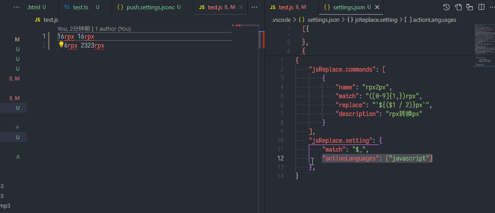

<style>
* {
    margin: 0;
    padding: 0;
    box-sizing: border-box;
}

.tabs {
  width: 650px;
  float: none;
  list-style: none;
  position: relative;
  margin: 80px 0 0 10px;
  text-align: left;
}

.tabs li {
  float: left;
  display: block;
  margin-right: 8px;
}

.tabs input[type="radio"] {
  position: absolute;
  top: 0;
  left: -9999px;
}

.tabs label {
  width: 100%;
  display: block;
  padding: 10px 16px;
  /*border-radius: 2px 2px 0 0;*/
  font-size: 18px;
  font-weight: normal;
  background: #636e72;
  color: #fff;
  cursor: pointer;
  position: relative;
  border-radius: 6px;
  /*top: 4px;*/
}

.tabs label:hover {
  background: #aaa;
}

.tabs .tab-content {
  z-index: 2;
  display: none;
  overflow: hidden;
  width: 100%;
  font-size: 17px;
  line-height: 25px;
  padding: 25px;
  position: absolute;
  /*top: 53px;*/
  left: 0;
}

.tabs [id^="tab"]:checked + label {
  top: 0;
  background: #f8da3c;
  color: #000;
}

.tabs [id^="tab"]:checked ~ [id^="tab-content"] {
  display: block;
}
</style>

<ul class="tabs" role="tablist">
<li>
<input type="radio" name="tabs" id="tab1" checked />
<label for="tab1"
    role="tab"
    aria-selected="true"
    aria-controls="panel1"
    tabindex="0">English Document</label>
<div id="tab-content1"
    class="tab-content"
    role="tabpanel"
    aria-labelledby="description"
    aria-hidden="false">

# JS Replace <!-- omit in toc -->

[English document](./README-en.md)

match text and transform with JavaScript expression


## Features

1.Matches the currently open editor content, transform with JavaScript expression
2.Manually select the text, transform with JavaScript expression

---

#### Use command

<details>
<summary>example</summary>


</details>

#### Use code action

<details>
<summary>example</summary>


</details>

## Configuration

#### Parameter description of replace

<details>
<summary>table</summary>

| parameter    | type     | description                                                                                                                                          |
| ------------ | -------- | ---------------------------------------------------------------------------------------------------------------------------------------------------- |
| `$1` to `$n` | `String` | Matched groupings from `$1` to `$n` (The variable prefix can be modified in the configuration)                                                       |
| `$_`         | `String` | The substring that the regular expression matches (The variable name can be modified in the configuration)                                           |
| `ChangeCase` | `Object` | The built-in [change case](https://www.npmjs.com/package/change-case) variable contains change-case utility functions, such as ChangeCase.pascalCase |

</details>

#### Configuration example

<details>
<summary>example</summary>

```json
{
    // Register the replace command
    "jsReplace.commands": [
        {
            // Replace command
            "name": "rpx2px",
            // A regular expression used to match literals
            "match": "([0-9]{1,})rpx",
            // Processing after matching, using js expressions,
            // $1 represents the first grouping content matched,
            // and $_ represents the matched substring
            "replace": "`${($1 / 2)}px`",
            // Describes the command content
            "description": "rpx to px"
        },
        {
            "name": "define pascalCase",
            "match": "\\w{1,}",
            "replace": "ChangeCase.pascalCase($_)",
            "description": "AaBb"
        }
    ],
    // Replace settings, configure variable name mappings for more parameters
    // and $1 to $n prefix customization
    "jsReplace.setting": {
        // Matching substrings
        "match": "$_",
        // If the prefix matches the grouping variable,
        // set to $, the variable is $1 to $n
        "prefix": "$",
        // Register the command with the code action
        "actionLanguages": [
            "javascript",
            "typescript",
            "html",
            "css",
            "less",
            "typescriptreact",
            "scss",
            "python",
            "markdown",
            "json",
            "javascriptreact",
            "sass",
            "go",
            "c",
            "vue"
        ],
        // For commands that need to be ignored in code action,
        // fill in the \"name\" field in jsReplace.commands
        "actionIgnoreCommands": [
            // For example: "define pascalCase"
        ],
        // Code action name formatting, $name represents the command's name,
        // $description represents the command's description
        "actionNameFormat": "JSR $name ($description)"
    }
}
```

</details>

#### Change case config example

<details>
<summary>example</summary>

```json
{
    "jsReplace.commands": [
        {
            "name": "noCase",
            "match": "\\w{1,}[ _-]?\\w{1,}",
            "replace": "ChangeCase.noCase($_)",
            "description": "aa bb"
        },
        {
            "name": "camelCase",
            "match": "\\w{1,}[ _-]?\\w{1,}",
            "replace": "ChangeCase.camelCase($_)",
            "description": "aaBb"
        },
        {
            "name": "pascalCase",
            "match": "\\w{1,}[ _-]?\\w{1,}",
            "replace": "ChangeCase.pascalCase($_)",
            "description": "AaBb"
        },
        {
            "name": "constantCase",
            "match": "\\w{1,}[ _-]?\\w{1,}",
            "replace": "ChangeCase.constantCase($_)",
            "description": "AaBb"
        },
        {
            "name": "snakeCase",
            "match": "\\w{1,}[ _-]?\\w{1,}",
            "replace": "ChangeCase.snakeCase($_)",
            "description": "aa_bb"
        },
        {
            "name": "pathCase",
            "match": "\\w{1,}[ _-]?\\w{1,}",
            "replace": "ChangeCase.pathCase($_)",
            "description": "aa/bb"
        },
        {
            "name": "paramCase",
            "match": "\\w{1,}[ _-]?\\w{1,}",
            "replace": "ChangeCase.paramCase($_)",
            "description": "aa-bb"
        },
        {
            "name": "dotCase",
            "match": "\\w{1,}[ _-]?\\w{1,}",
            "replace": "ChangeCase.dotCase($_)",
            "description": "aa.bb"
        },
        {
            "name": "sentenceCase",
            "match": "\\w{1,}[ _-]?\\w{1,}",
            "replace": "ChangeCase.sentenceCase($_)",
            "description": "aa bb"
        },
        {
            "name": "capitalCase",
            "match": "\\w{1,}[ _-]?\\w{1,}",
            "replace": "ChangeCase.capitalCase($_)",
            "description": "Aa Bb"
        }
    ]
}
```

</details>
</div>
</li>
<li>
<input type="radio" name="tabs" id="tab2" />
<label for="tab2"
        role="tab"
        aria-selected="false"
        aria-controls="panel2"
        tabindex="0">中文文档</label>
<div id="tab-content2"
        class="tab-content"
        role="tabpanel"
        aria-labelledby="specification"
        aria-hidden="true">

# JS Replace <!-- omit in toc -->

[中文文档](./README-zh-cn.md)

匹配文本，对选中文本执行 js 表示式，获取结果后替换内容


## 功能

1.对当前打开的编辑器内容进行匹配，对选中文本执行 js 表示式，获取结果
2.手动选中文本，对匹配内容执行 js 表示式，获取结果

---

#### 使用命令

<details>
<summary>示例</summary>


</details>

#### 使用 code action

<details>
<summary>示例</summary>


</details>

## 配置

#### replace参数说明

<details>
<summary>参数说明</summary>

| 参数         | 类型     | 说明                                                                                                                          |
| ------------ | -------- | ----------------------------------------------------------------------------------------------------------------------------- |
| `$1 到 $n`   | `String` | 匹配到的分组内容，从 `$1` 到 `$n` (配置中可修改变量前缀)                                                                      |
| `$_`         | `String` | 匹配到的子串，即正则表达式匹配到的内容（配置中可修改该变量名）                                                                |
| `ChangeCase` | `Object` | 内置的 [change case](https://www.npmjs.com/package/change-case) 变量，包含 change-case 的工具函数，例如 ChangeCase.pascalCase |

</details>

#### 配置示例

<details>
<summary>配置说明</summary>

```json
{
    // 注册replace命令
    "jsReplace.commands": [
        {
            // 指令名称
            "name": "rpx2px",
            // 用于匹配文字的正则表达式
            "match": "([0-9]{1,})rpx",
            // 匹配后的处理，使用js表达式，
            // $1表示匹配到的第一个分组内容，$_表示匹配的子串
            "replace": "`${($1 / 2)}px`",
            // 描述
            "description": "rpx转换px"
        }
    ],
    "jsReplace.setting": {
        // 匹配的子串变量
        "match": "$_",
        // 匹配到分组变量的前缀，设置为$，则变量为$1到$n
        "prefix": "$",
        // 将命令注册到code action中
        "actionLanguages": [
            "javascript",
            "typescript",
            "html",
            "css",
            "less",
            "typescriptreact",
            "scss",
            "python",
            "markdown",
            "json",
            "javascriptreact",
            "sass",
            "go",
            "c",
            "vue"
        ],
        // code action需要忽略的命令，填写jsReplace.commands中定义的"name"字段
        "actionIgnoreCommands": [
            // 例如："define pascalCase"
        ],
        // Code action 命令名称格式化，
        // $name代表命令的name字段，$description代表命令的description字段
        "actionNameFormat": "JSR $name ($description)"
    }
}
```

</details>

#### change case 配置

<details>
<summary>示例</summary>

```json
{
    "jsReplace.commands": [
        {
            "name": "noCase",
            "match": "\\w{1,}[ _-]?\\w{1,}",
            "replace": "ChangeCase.noCase($_)",
            "description": "aa bb"
        },
        {
            "name": "camelCase(大驼峰)",
            "match": "\\w{1,}[ _-]?\\w{1,}",
            "replace": "ChangeCase.camelCase($_)",
            "description": "aaBb"
        },
        {
            "name": "pascalCase(小驼峰)",
            "match": "\\w{1,}[ _-]?\\w{1,}",
            "replace": "ChangeCase.pascalCase($_)",
            "description": "AaBb"
        },
        {
            "name": "constantCase(常量)",
            "match": "\\w{1,}[ _-]?\\w{1,}",
            "replace": "ChangeCase.constantCase($_)",
            "description": "AaBb"
        },
        {
            "name": "snakeCase(下划线)",
            "match": "\\w{1,}[ _-]?\\w{1,}",
            "replace": "ChangeCase.snakeCase($_)",
            "description": "aa_bb"
        },
        {
            "name": "pathCase(路径分隔符)",
            "match": "\\w{1,}[ _-]?\\w{1,}",
            "replace": "ChangeCase.pathCase($_)",
            "description": "aa/bb"
        },
        {
            "name": "paramCase(横杠分隔)",
            "match": "\\w{1,}[ _-]?\\w{1,}",
            "replace": "ChangeCase.paramCase($_)",
            "description": "aa-bb"
        },
        {
            "name": "dotCase(点分隔)",
            "match": "\\w{1,}[ _-]?\\w{1,}",
            "replace": "ChangeCase.dotCase($_)",
            "description": "aa.bb"
        },
        {
            "name": "sentenceCase(空格分隔单词)",
            "match": "\\w{1,}[ _-]?\\w{1,}",
            "replace": "ChangeCase.sentenceCase($_)",
            "description": "aa bb"
        },
        {
            "name": "capitalCase(首字母大写分隔单词)",
            "match": "\\w{1,}[ _-]?\\w{1,}",
            "replace": "ChangeCase.capitalCase($_)",
            "description": "Aa Bb"
        }
    ]
}
```

</details>

</div>
</li>
</ul>
